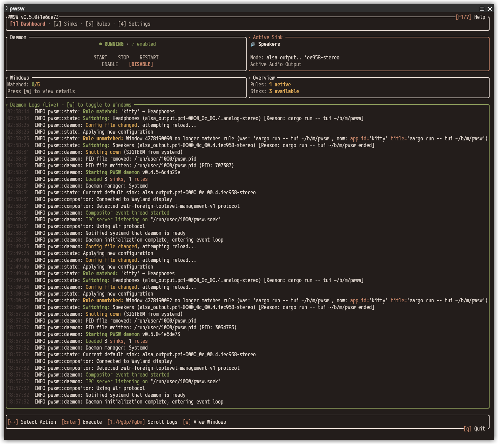

# <p align="center">PWSW - PipeWire Switcher</p>

<p align="center">
  <a href="https://github.com/ledati16/pwsw/actions/workflows/ci.yml"></a>
  <a href="LICENSE"></a>
  <a href="https://www.rust-lang.org/"></a>
  <a href="Cargo.toml#L101-L116"></a>
  <a href="https://ratatui.rs/"></a>
  <a href="#appendix-llm-generated-code"></a>
</p>

<p align="center"></p>

## What is PWSW?

PWSW automatically switches your PipeWire audio output based on active windows. Launch a game? Audio goes to speakers. Open Discord? Switches to headset. Close the window? Switches back.

Uses standard Wayland protocols for window monitoring and PipeWire native tools for audio control.

## Features

- **Automatic sink switching** based on window app_id/title patterns (regex)
- **Interactive TUI** - Full terminal UI with:
  - Real-time dashboard with log & window monitoring
  - Visual rule editor with live regex preview
  - Sink management and testing
  - Context-aware keybindings and navigation
- **Priority modes** - temporal (recent window) or index-based (rule order)
- **Profile switching** - handles analog/digital device profile changes
- **Desktop notifications** - optional alerts for manual and automatic switches
- **IPC daemon** - background service with Unix socket control
- **JSON output** - for scripting and status bar integration
- **Compositor agnostic** - uses standard Wayland protocols

## Supported Compositors

### ✅ Fully Supported
- **ext-foreign-toplevel-list-v1** - The new official Wayland standard for window monitoring.
- **wlr-foreign-toplevel-management** - Standard protocol for wlroots-based compositors (Sway, Hyprland, etc.).

**Verified Compositors:**
Sway • Hyprland • Niri • River • Wayfire • labwc • dwl • hikari • Cosmic

### ❌ Not Supported
- **GNOME/Mutter** - Does not expose window management protocols
- **KDE Plasma 6** - Removed protocol support (until they implement the `ext` protocol)

> **Note:** PWSW automatically detects and prioritizes the newer `ext` standard over the legacy `wlr` protocol. Any compositor implementing either protocol is supported.

## Quick Start

```bash
# 1. Install dependencies (Arch example)
sudo pacman -S pipewire pipewire-pulse rust cargo

# 2. Build and install
cargo install --path .

# 3. Discover audio outputs
pwsw list-sinks

# 4. Edit config
pwsw validate                         # Creates default config if missing
$EDITOR ~/.config/pwsw/config.toml

# 5. Start daemon
pwsw daemon
```

## Usage

### Interactive TUI

```bash
pwsw tui
```
Launch the full terminal interface. Use number keys `1-4` to switch tabs:
1. **Dashboard:** Monitor daemon status, logs, and active windows
2. **Sinks:** Manage available audio outputs
3. **Rules:** Create and edit matching rules with live preview
4. **Settings:** Configure global behavior

Press `?` or `F1` for context-aware help.

### Commands

**Status and monitoring:**
```bash
pwsw
pwsw status
pwsw list-windows
```
Show current status (default command), supports `--json` output. `list-windows` requires daemon.

**Daemon control:**
```bash
pwsw shutdown
```
Stop daemon gracefully.

**Testing and validation:**
```bash
pwsw test-rule "^mpv$"
pwsw validate
pwsw list-sinks
```
- `test-rule`: Test regex against tracked windows (requires daemon)
- `validate`: Check config syntax (no daemon needed)
- `list-sinks`: List audio outputs (no daemon needed, supports `--json`)

**Manual sink control:**
```bash
pwsw set-sink "Headphones"
pwsw next-sink
pwsw prev-sink
```
- `set-sink`: Switch to sink by desc, name, or position (1, 2, 3...)
- `next-sink`: Cycle to next configured sink (wraps around)
- `prev-sink`: Cycle to previous configured sink (wraps around)

No daemon needed. Useful for keybindings.

## Configuration

**Location:** `~/.config/pwsw/config.toml`

### Settings

```toml
[settings]
default_on_startup = false
set_smart_toggle = true
notify_manual = true
notify_rules = true
match_by_index = false
log_level = "info"
```

**Options:**
- `default_on_startup`: Switch to default sink on daemon start (default: false)
- `set_smart_toggle`: Toggle back to default if target sink is already active
- `notify_manual`: Desktop notifications for manual switches
- `notify_rules`: Desktop notifications for rule-triggered switches
- `match_by_index`: false = recent window wins, true = first rule wins
- `log_level`: error, warn, info, debug, trace

### Sinks

```toml
[[sinks]]
name = "alsa_output.pci-0000_0c_00.4.iec958-stereo"
desc = "Optical Out"
default = true
icon = "audio-card"

[[sinks]]
name = "alsa_output.pci-0000_0c_00.4.analog-stereo"
desc = "Headphones"
```

**Fields:**
- `name`: PipeWire node name (find with `pwsw list-sinks`)
- `desc`: Human-readable label
- `default`: Fallback sink (exactly one required)
- `icon`: Optional notification icon override

**Auto-detected icons:**
- HDMI/TV/display: video-display
- headphone/headset/bluetooth: audio-headphones
- Everything else: audio-speakers

### Rules

```toml
[[rules]]
app_id = "^steam$"
title = "^Steam Big Picture Mode$"
sink = "Optical Out"
desc = "Steam Big Picture"
notify = false

[[rules]]
app_id = "^mpv$"
sink = 2
```

**Fields:**
- `app_id`: Regex pattern for window app_id (required)
- `title`: Regex pattern for window title (optional)
- `sink`: Reference by desc, name, or 1-indexed position
- `desc`: Custom notification label (optional)
- `notify`: Override global notify_rules setting (optional)

**Find app_id/title:**
```bash
pwsw list-windows    # Requires daemon running
pwsw test-rule ".*"  # Show all windows with pattern matching

# Compositor tools:
swaymsg -t get_tree  # Sway/River/wlroots
hyprctl clients      # Hyprland
niri msg windows     # Niri
```

**Regex examples:**
```toml
app_id = "firefox"        # Substring match
app_id = "^firefox$"      # Exact match
app_id = "^(mpv|vlc)$"    # Multiple options
app_id = "(?i)discord"    # Case insensitive
app_id = ".*"             # Any (useful with title-only matching)
```

**Title-only matching:**
```toml
[[rules]]
app_id = ".*"       # Match any app
title = "YouTube"   # Filter by title
sink = "Speakers"
```

### Complete Example

```toml
[settings]
default_on_startup = false
set_smart_toggle = true
notify_manual = true
notify_rules = true
match_by_index = false
log_level = "info"

[[sinks]]
name = "alsa_output.pci-0000_0c_00.4.iec958-stereo"
desc = "Optical Out"
default = true

[[sinks]]
name = "alsa_output.pci-0000_0c_00.4.analog-stereo"
desc = "Headphones"

[[rules]]
app_id = "^steam$"
title = "^Steam Big Picture Mode$"
sink = "Optical Out"
desc = "Steam Big Picture"

[[rules]]
app_id = "^mpv$"
sink = "Headphones"
```

## Advanced

### Profile Switching

PWSW automatically switches device profiles when needed (e.g., analog ↔ digital on same card):
1. Detects if sink requires profile switch
2. Uses `pw-cli` to switch profile
3. Waits for new sink node (with retries)
4. Sets as default with `pw-metadata`

### Priority Modes

- **`match_by_index = false`** (default): Most recent window wins
- **`match_by_index = true`**: First matching rule wins

Example with `match_by_index = true`:
```toml
[[rules]]              # Index 0 - highest priority
app_id = "^mpv$"
sink = "Headphones"

[[rules]]              # Index 1 - lower priority
app_id = "^firefox$"
sink = "Speakers"
```
With both Firefox and MPV open → Headphones (rule at index 0 wins, regardless of which window opened first)

### IPC Socket

- **Location:** `$XDG_RUNTIME_DIR/pwsw.sock` or `/tmp/pwsw-$USER.sock`
- **Permissions:** `0o600` (user-only)
- Stale sockets auto-cleaned on daemon start

### Logging

Set in config: `log_level = "debug"`

Levels: error < warn < info < debug < trace

View logs: `pwsw daemon --foreground`

### Autostart (systemd)

For automatic startup on login, see `contrib/pwsw.service`.

## Building

### Prerequisites

**Rust toolchain:**
```bash
curl --proto '=https' --tlsv1.2 -sSf https://sh.rustup.rs | sh
```

**PipeWire tools** (Arch example):
```bash
sudo pacman -S pipewire pipewire-pulse
```

Requires: `pw-dump`, `pw-metadata`, `pw-cli` (usually bundled with PipeWire)

### Build Commands
```bash
cargo build --release
cargo install --path .
cargo check
cargo test
cargo clippy
```

- `build --release`: Optimized build at `target/release/pwsw`
- `install --path .`: Install to `~/.cargo/bin/`
- `check`: Fast syntax validation
- `test`: Run test suite
- `clippy`: Lint code

## Appendix: LLM-Generated Code

> ⚠️ **Important Disclosure**

This project was **entirely generated by LLMs** (mainly Claude models) by someone without Rust experience.

**Key facts:**
- **100% LLM-generated**, no peer review by Rust developers
- Works as intended with no malicious code, but use with caution
- Personal tool, not production-grade software
- **Do not package for distributions** without peer review

**Code quality:**
- **Pedantic clippy** with only 20 documented allows (strict linting enforced)
- **Safe architecture**: Process isolation for PipeWire, atomic config writes
- Comprehensive test suite (143 tests) with strict isolation
- See [CLAUDE.md](CLAUDE.md) for standards

[Discussions](https://github.com/ledati16/pwsw/discussions) open for community review.

**Fork and rename** if you want to maintain/improve this project (link back appreciated).

Similar to [Belphemur/SoundSwitch](https://github.com/Belphemur/SoundSwitch) but for Wayland + PipeWire.

---

**License:** [LICENSE](LICENSE) • **Discussions:** [GitHub](https://github.com/ledati16/pwsw/discussions)
